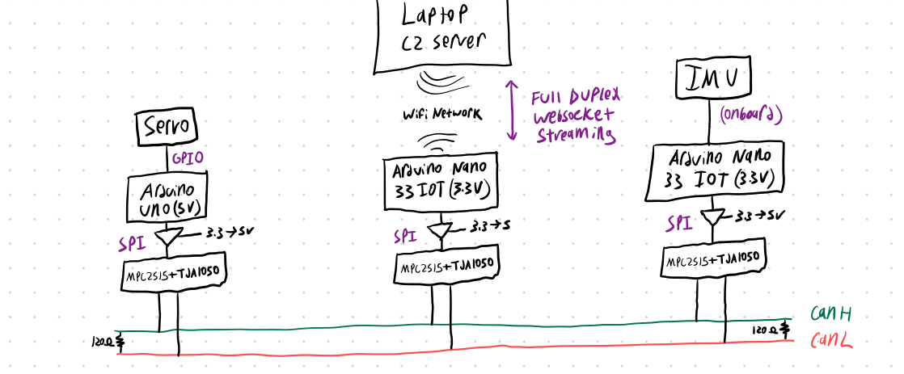
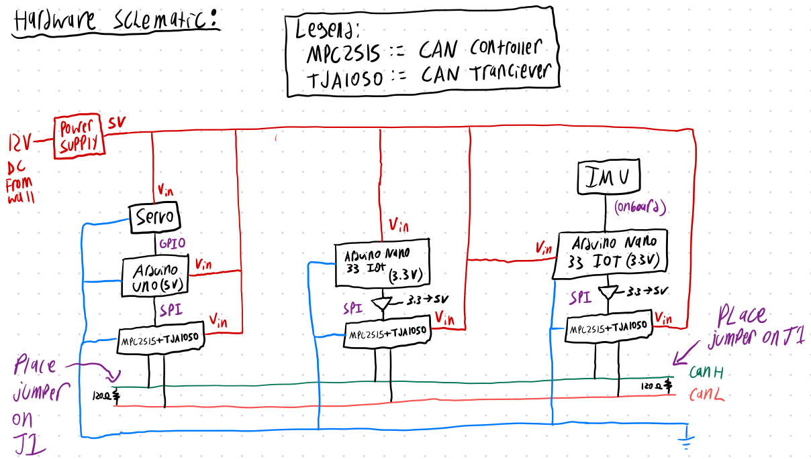
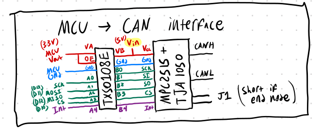
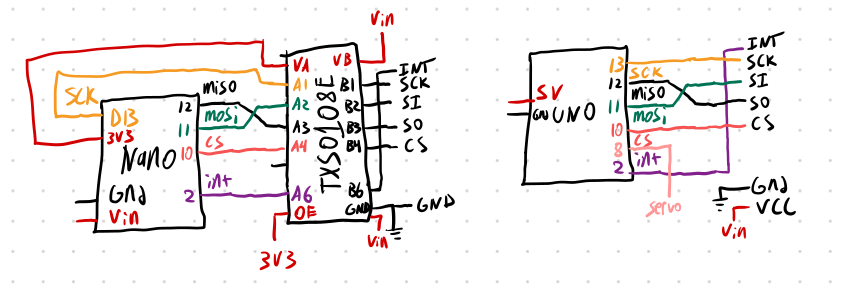
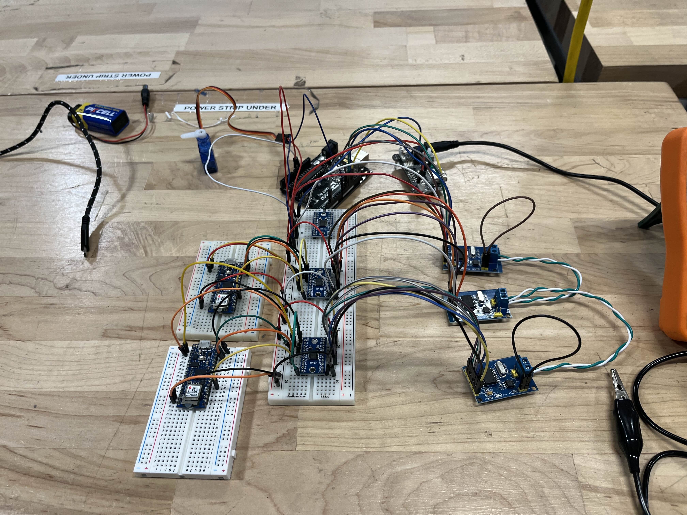
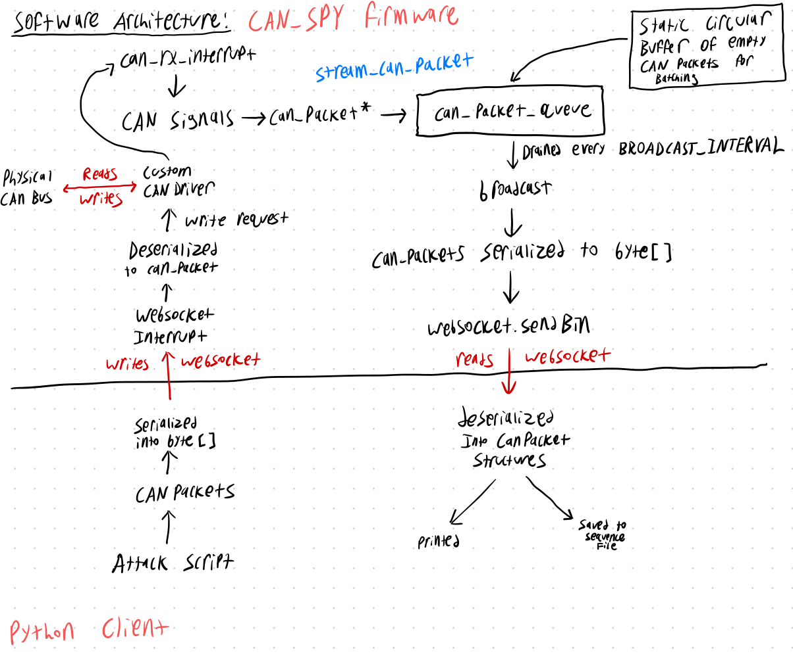

# Report

# Table of Contents
* [Abstract](#abstract)
* [Introduction](#1-introduction)
* [Related Work](#2-related-work)
* [Technical Approach](#3-technical-approach)
* [Evaluation and Results](#4-evaluation-and-results)
* [Discussion and Conclusions](#5-discussion-and-conclusions)
* [References](#6-references)

# Abstract

This project aims to create an extensible platform for developing and testing Controller Area Network (CAN) exploits, addressing the security vulnerabilities inherent in the widely-used CAN protocol. Despite being robust and reliable, CAN's age and lack of modern security measures expose critical infrastructure, including automotive and industrial systems, to potential attacks. Current research tools often focus on automotive applications, require physical access to the CAN bus, and are expensive or limited in functionality. This project proposes a novel, modular, and open-source framework that allows for wireless CAN communication and can be easily extended to support more complex attacks. By unifying hardware and software components, it simplifies the process for security researchers and engineers, lowering the barrier to entry for CAN security testing. The platform’s low-cost design and extensibility aim to foster broader use in both automotive and non-automotive systems while providing tools for secure CAN system development.

# 1. Introduction

## Motivation and Objective
The Controller Area Network (CAN) protocol is an extremely common serial communication protocol used frequently in large complex systems like automobiles, ships, trains, planes, factories, and other industrial technologies. It's priority based arbitration design makes it appealing to systems where reliability and real-time responses are critical. While robust and flexible, the standard is relatively old, and thus doesn't hold up under modern security standards. As a result, the standard is a serious weak point in critical infrastructure and thus in recent years it has drawn much attention from bad actors and security researchers alike. The goal of this project is to provide an extensible platform for developing CAN exploits for use by security researchers when protecting against these attacks.

## Current State of the Art
Currently, security researchers seeking to harden their system have a couple options. Most attacks in this field focus on automotive attacks as cars are the most prevalent users of CAN in our daily lives. As a result, a lot of the existing infrastructure is based around cars. One such example hardware is the OBD-II cable. OBD-II is the standard used to read information from a cars computer system. It provides a standard port which allows you to read from the internal CAN bus along with a couple other buses. This is almost always the hardware associated with CAN security research.

Once you have access to the physical CAN bus via the OBD-II cable, you can read or write from the CAN bus using `can-utils`. This is a repository of command line tools which you can use to interact with the CAN bus.

However, most security research is actually done in simulation. One such simulator is

Taking all of this into account, the current state of the art effectively involves developing your exploit in the simulator using `can-utils`, and then testing it using an OBD-II cable.

This can be effective for people trying to write attacks for existing cars, but it does little to address attacks while developing systems or non-automotive attacks. Additionally, using `can-utils` can be constricting if you need to develop more complex attacks. Also, testing and carrying out attacks require physical access to the CAN-bus. While there are wireless OBD-II readers, they are limited to systems using OBD-II. Finally, existing hardware solutions are relatively expensive, with wireless OBD-II readers costing up to $200.

Few projects have unified all these pieces into one simple, extensible, and easy to use framework, which is what this project aims to do.

## Novelty and Rationale

While no individual part of the project is particularly novel, the unificafion of all parts is where it becomes truly novel.

While wireless OBD-II readers exist, they are limited to automotive applications and have little purpose for security research due to their lack of support for complex attacks. Also, they almost exclusively use Bluetooth. While the initial iteration of this project uses WiFi, the hardware and software frameworks are modular open source, meaning it would be easy to extend the capabilities in the future to support much longer range attacks protocols like LoRa which could open the door to a huge amount of new attacks.

Additionally, this framework is geared towards the development of safer systems instead of interacting with existing systems. As such, it's hardware interface is raw CAN as opposed to OBD-II providing more flexibility across domains other than automotive.

As far as I know, there are no existing python frameworks that allow you to wirelessly read/write to a physical CAN bus, and thus this is the first of it's kind.

Finally, the device can likely be mass produced for less than $20 a piece given that it simply requires an MCU, CAN hardware, and some sort of wireless module.

## Potential impact

The overall goal of this project is to help improve the security of digital infrastructure by developing a tool which can be useful for security researchers to efficiently hunt for potential vulnerabilities in CAN systems. It can also be used by engineers when developing new systems to keep them more secure, as well as less experienced. The list of command line scripts (while currently small) of common attacks will also be an easy way for researchers to make sure their system holds up against the most trivial of attacks before needing to develop anything fancy.

The extensible python package is also great as it lowers the barrier to entry significantly for CAN security. Existing solutions require expert knowledge in C and linux which some people might not have. This project gives makes it easy to develop exploits and search for vulnerabilities without extensive knowledge of these systems. Even for experienced users, it may make the process of security research more efficient and less error prone.

## Challenges:
The main challenge in completing this project is developing the hardware. For reasons mentioned in the technical section, CAN is actually rather complicated and requires several additional pieces of hardware to get working. Testing the hardware also requires a mock system (testbed), which will need to be designed and implemented. This is compounded with my limited background in hardware and reasonably short time constraints. 

Another challenge is reliable websocket connections between the software C2 server and the hardware. In my experience, getting websockets to run reliably on Arduino is quite difficult. Many libraries are buggy, or simply don't work as intended. Using websockets in python also requires asynchronous programming paradigms which can be tricky to get correct without bugs.

Finally, reliably streaming CAN traffic via websocket is difficult given that the max bitrate of CAN is 1 megabit per second. While WiFi can easily handle this, we eventually want the project to support other wireless technologies such as LoRa and Bluetooth so we need to address this bottleneck.

## Requirements for Success:
In order for this project to succeed, I will need the available hardware and advice on how to implement the hardware for the actual device along with baseline electrical engineering skills and knowledge. This is all available via Amazon, IEEE, and the makerspace. The software skills required include Python programming, C programming, embedded C practices, and network programming (especially websockets) all of which I have proficiency in.

## Metrics for Success
Overall, the success of this project is determined by whether I can get the following features working.

* CAN system testbed with two mock ECU's, a sensor (IMU) and actuator (servo)
* Byte level read/write access to the physical CAN bus
* A python package which allows persistent websocket connection and remote read/write access to CAN bus via the device.
* Several out of the box command line utilities for common attack and workflows

# 2. Related Work

Most of the related work was covered in the [Current State of the Art](#current-state-of-the-art) section, however there are some other interesting areas of research devoted to the theory behind CAN security. Generally this research targets the discovery of more attacks and defense strageties. Attacks are divided into two categories, Protocol level attacks and Controller level attacks.

Protocol level attacks take advange of vulnerabilities inherent in the protocol, and can thus be executed by writing cleverly crafted CAN packets to the bus. A couple notable ones are listed below.
  * Replay Attacks. These are done by simply recording traffic from the CAN bus when an operation is taking place, and then replaying the recorded traffic at a later time to reproduce the operation. Replay attacks are by far the most common because of how easy they are to execute. You can have little to no understanding of how the system works and still easily execute the attack.
  * Spoofing. This attack involves sending traffic that masquerades as traffic from another node in order to precisely control the behavior of the system. This attack is a little more difficult to pull off as it requires a base understanding of the system which can be garnered through reverse engineering of collected traffic.
  * Denial of Service. This attack involves flooding the bus with extremely high priority packets in an attempt to collide with other packets in the system crippling its ability to function properly.

Controller level attacks require complete control over the CAN controller which is a specialized piece of hardware used to manage bitstream level operations. While I'm not an expert in this area of research it seems to be very active since access to the CAN controller lends itsself to far more insidious low level attacks. For example, protocol level attacks can be largely mitigated by encryption whereas Controller level attacks cannot.

# 3. Technical Approach

## System Design

At a high level, the system consists of three components. First, is the can-spy hardware device. This device effectively acts as a bridge between the python package and the physical can bus. It is wirelessly enabled so that it can connect via websockets to a command and controller (C2) server running on a laptop. Its responsibilities include reading and writing bytes to the CAN bus, streaming the data to the C2 server, and listening for instructions from the C2 server.

Next, the command and controller (C2) server. This server provides an interface for the device to the user. This server and the associated python package allow the user to read and write bytes arbitrarily to the CAN bus over the network.

Finally, the testbed. The testbed is meant to mimic a real CAN system so that we can actually develop the other two pieces. It consists of 2 mock ECUs. The first is an IMU connected to a microcontroller which writes sensor readings to the CAN-bus for the other ECU to read. The second consists of a servo and a microcontroller and listens for sensor readings from the first ECU which are then processed and used to match the servo angle with that of the IMU.


*High level system architecture diagram*

## Hardware

This implementation required three microcontrollers along with some CAN hardware (mentioned later), and a 5V power supply to run. The main challenge when designing this hardware was the mixture of 3.3v and 5v devices which was addressed with the use of level shifters.


*Mid-detail hardware schematic*

### CAN Requirements

Creating a CAN bus from scratch is actually rather complicated and requires a couple pieces of specialized hardware. A CAN bus is composed of two lines `canh` and `canl`. To write data to these lines, you need both a CAN controller and a CAN transceiver.

The CAN controller is responsible for converting packets into bitstreams and vice-versa. It also buffers received bits until they form full packets. Few microcontrollers have these built-in, so you generally need a standalone controller. One such controller is the MCP2515 which operates at 5v and has an SPI interface. It also triggers a hardware interrupt whenever it receives a packet which is incredibly convenient on the software side.

The CAN transceiver is the hardware which actually writes to the `canh` and `canl` lines after receiving bits from the CAN controller. It's main job is to convert logic levels to differential signals and vice-versa and it pretty much acts as a middle-man between the CAN controller and the CAN bus. Virtually no microcontrollers have these built in (except in extremely specialized cases eg. NXPLPC11C00) so you generally have to use a standalone one like the TJA1050.

Luckily there's a development board which combines both the MCP2515 and the TJA1050 which we ended up using for this project.


*Note: the nano operates at 3.3v and thus requires a 3.3V-5V level shifter (TXS0108E) to communicate with the MCP2515 controller*



*Detailed connection diagram for the various microcontrollers and CAN controller/transceiver chips*

### Testbed

Recall that the testbed is composed of two mock ECUs: one which acts a sensor, and one which acts as an actuator.

The sensor ECU is an Arduino Nano 33 iot which reads from its onboard IMU (LSM6DS3) and connects to the CAN bus using the MCP2515 + TJA1050 CAN board mentioned in the last section. However, this board runs at 3.3v and thus requires a level shifter to interact with the CAN board over SPI. For this, we used the TXS0108E 3.3v --> 5v level shifter. The nano simply reads `ay` from the IMU every `10ms` and normalizes its value as an integer between 0 and 90. Then it relays this integer as CAN packet with id `0x12`.

The Actuator ECU is and Arduino Uno which writes to a standalone Servo [SG90](http://www.ee.ic.ac.uk/pcheung/teaching/DE1_EE/stores/sg90_datasheet.pdf) and reads from the CAN bus using the aforementioned CAN board. It reads from the CAN bus every `1ms` and then updates the servo position accordingly if it has received a new reading. One thing to note is that attempting to update the servo position too fast becomes problematic, so I implemented a basic smoothing algorithm to prevent this from being an issue.

### CAN-spy

Similar to the sensor node in the testbed, the actual CAN-spy device is also an Arduino Nano 33 iot attached to an MCP2515 + TJA1050 board via SPI across a 3.3v --> 5v level shifter. However, this device has more responsibilities as it needs to manage its websocket connection, stream CAN traffic to the C2 server in batches every `25ms`, and write bytes to the bus based on the C2 servers demands.

You can view the full system hardware schematic [here](media/hardware-schematic.pdf).


*The entire testbed operates at ~115 milliamps*




*Top down view*

## Software

The two main pieces of software (in addition to the comparatively simple testbed software) were the can-spy firmware and the python package used to connect with it.

### Firmware

The firmware was written in C++ using the Arduino framework along with platformio and it performs reads and writes to the CAN bus using the arduino-CAN library. It's main responsibilities are as follows.
* Streaming CAN traffic. Whenever a new CAN packet is received, a hardware interrupt is triggered which queues a packet the packet for streaming. This queue is periodically emptied every `25ms` when all the CAN packets inside of it are serialized into a large buffer which is then delivered to C2 Server via the websocket connection. Note that there may be extremely large volumes of CAN packets, and thus we queue up to 1000 of them so the queue and buffer can be statically allocated. Additionally, we statically allocate all 1000 CAN packets statically. This is done to to bolster performance and avoid heap fragmentation by preventing large amounts of heap allocation.
* Writing CAN traffic. Whenever the device receives a write request from the C2 server, it will come in the form of a serialized CAN packet. This packet is then deserialized and simply written to the bus.
* Managing wireless connections. The device connects to the C2 server using WiFi and Websockets. WiFi was choosen out of convenience for libraries, however the framework could be easily extended to use other technologies in the future. Websockets on the other hand are practically ubiquitous when it comes to arduino programming, and they are also as performant as regular sockets so they were an obvious choice. Our code makes use of the WiFiNINA library and the arduinoWebSockets libraries.

### Python Package

The Python package is located in the `can_spy` directory in the repository and it's infrastructure is managed using `setuptools`. You can find documentation on how to install it in the package `README.md`.

The package itsself provides a couple utilities, but it's main goal is to provide simple primitive which allow arbitrary byte level read/write access to the CAN bus. Each CAN packet is represented using the following structure.

```py
@dataclass
class CanPacket:
    """Represents a single can_packet"""
    data: bytes
    timestamp: int
    can_id: int
    length: int 

    def serialize(self) -> bytes:
      ...

    @classmethod
    def deserialize(cls, buffer: bytes) -> CanPacket:
      ...
```

The data, can_id, and length are all analogous to the same fields in actual CAN packets. The timestamp represents the number of microseconds the packet was received after the can-spy firmware started running. It is really only used to distinguish packets in large sequence files for use in replay attacks, so it can be ignored when writing.

The package also introduces the `C2Server` primative which is used to connect with the can-spy device.

```py
class C2Server:
    """C2 server used to handle connection with hardware"""

    def __init__(self,
                 server_address: str = "0.0.0.0",
                 server_port: int = 3005,
                 client_handler = None):
      ...
    
    def serve_forever(self):
      ...

    async def start_websocket_server(self):
      ...
```

The C2 sever manages websocket connections using `asyncio` and `websockets`. Finally, there are several command line utilities which perform common attacks, but those are discussed more in the next section.


*Flowchart of data throughout software system*

You can view the full software diagram [here](media/software-diagram.pdf).

# 4. Evaluation and Results

As previously stated, this project is not a traditional research project and thus the evaluation is more qualitative and will consist mostly of demos and example code.

The most powerful part of the python framework is that it allows you to arbitrarily read and write bytes to the CAN bus which means it is capable or remotely performing any protocol level attack without direct physical access to the CAN BUS. For example, lets say you wanted to perform a spoofing attack specific to your system where you spoofed sensor readings. You could use the script below to do so.

```py
#!/usr/bin/python3

import asyncio
import random

from can_spy.can_packet import CanPacket
from can_spy.c2_server import C2Server


async def handle_client(websocket):
    angle = random.randint(15, 60)
    angle = 30
    while True:
        print("Set angle to 30")
        packet = CanPacket(
            data=angle.to_bytes(1, byteorder='little', signed=True),  # Actual byte level payload
            timestamp=0, # Arbitrary in this case
            can_id=0x10,
            length=1
        )

        await websocket.send(packet.serialize())
        await asyncio.sleep(0.5)

def main():
    """Spoofing attack example script"""

    c2 = C2Server(client_handler=handle_client)
    c2.serve_forever()
        
if __name__ == "__main__":
    main()
```

While the read/write capability is probably the most useful for researchers developing custom attacks, some attacks are so common that I've written some out of the box command line programs to perform them automatically. These tools also act as a starting point for researchers as they can easily check their system for obvious or common vulnerabilities using these tools.

### Replay Attack

Probably the most common type of CAN attack is the replay attack. This attack consists of recording activity on the CAN bus, and then replaying it in some way. This allows you to control the behavior of the system by simulating previous activity. It's very common due to accessibility as it doesn't nessecarily require an understanding of the systems inner workings to perform.

Using our framework, you can perform replay attacks using a combination of two command line programs.

First you can use the `can-listen` program to record activity into a file. This file simply contains the serialized version of the list of `CanPacket`s.

```
can-listen -o example.can
```

Next you can use the `can-replay` program to read one of these files and write the recorded activity to the bus.

```
can-replay -f example.can
```

### Listening

As previously mentioned, you can use the `can-listen` script to dump CAN traffic from the device, however you can also use the following options to control more details.

```
usage: can-listen [-h] [-o OUTFILE] [-s] [-n]

Records and serializes websocket activity to a pickle file for later examination or use in replay attack.

options:
  -h, --help            show this help message and exit
  -o OUTFILE, --outfile OUTFILE
                        Path of the file to save recorded CAN activity to.
  -s, --no-stdout       Hides incoming CAN activity from stdout. Can help reduce latency.
  -n, --no-file         Prevents incoming CAN activity from being written to a file if present.
```

More information on these scripts and the API can be found in the `can_spy` within the [Github Repo](https://github.com/RoryHemmings/CAN-spy).

# 5. Discussion and Conclusions

## Impact

Overall, we achieved our requirements for success, and thus anyone with basic python skills and a high level knowledge of CAN now has the ability to test attacks on their system to make it more secure, granted the hardware is very clunky at the moment.

## Future plans

While the current state of the project is mainly an MVP, there is a lot of potential for future plans. The primary focus for future plans is on improving the hardware. First, we want to create a custom PCB so that the hardware is usable outside of a development setting. This would be similar to the development hardware, except with a built-in OBD-II port in addition to standard `canh` and `canl` lines.

Another main plan is to add support for LoRa, to enable extremely long range attacks. This would open the door to a whole host of novel attacks as they could be performed at extremely long ranges not achievable by other wireless protocols.

Regarding software, we would like to greatly increase the number of demo attack scripts to provide a library of attacks that any one can test against their system. Also, we would like to implement a REPL environment which maintains a constant websocket connection between attacks for rapid exploit testing and development when connected to the hardware. For example, you could perform a replay attack in a more user friendly way as the MVP requires the use of two different scripts.

# 6. References

1. Tindell K, (2020). "CAN Security: CAN Protocol Security White Paper". https://www.canislabs.com/downloads/2020-02-14-White-Paper-CAN-Security.pdf
2. Bloom B. (2021). "WeepingCAN: A stealthy CAN Bus-off Attack". https://gedare.github.io/pdf/bloom_weepingcan_2021.pdf
3. Ojha Y. (2019). "Car Hacking 101: Practical Guide to Exploiting CAN-Bus using Instrument Cluster Simulator". https://medium.com/@yogeshojha/car-hacking-101-practical-guide-to-exploiting-can-bus-using-instrument-cluster-simulator-part-i-cd88d3eb4a53
4. "Create Your Own CAN Network With MCP2515 Modules and Arduino". https://lastminuteengineers.com/mcp2515-can-module-arduino-tutorial/
5. https://docs.arduino.cc/learn/communication/can/
